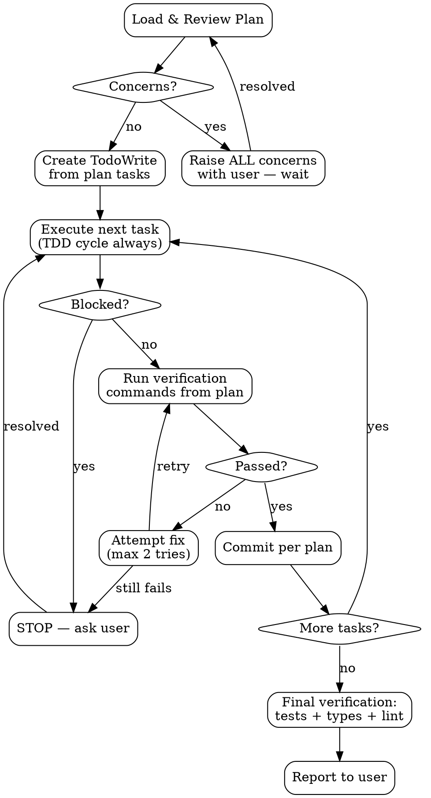

# Executing Implementation Plans

Load plan, review critically, execute all tasks with TDD discipline, verify each step, report when complete.

**Announce at start:** "Executing plan: `[plan file path]`"

## Process

### Step 1: Load & Review Plan

1. Read the plan file completely
2. Review critically — look for:
   - Placeholder text, TODOs, "similar to X" without concrete code
   - Missing file paths or incomplete code blocks
   - Steps that contradict `.cursor/rules` conventions
   - Unclear verification commands or expected outputs
   - Tasks with code changes but no corresponding tests
3. **Concerns exist →** Raise ALL concerns with the user. Do not start execution. Do not cherry-pick — surface everything at once.
4. **No concerns →** Proceed to task tracking.

### Step 2: Execute Tasks

Create TodoWrite items — one per task (e.g., "Phase 1 — Task 1.1: Create login form"). First task `in_progress`, rest `pending`.

For each task, in plan order:

1. Mark `in_progress` in TodoWrite
2. Follow each step **exactly as written**:
   - Copy code from plan verbatim — do not paraphrase, reformat, or "improve"
   - Run exact commands specified in the plan
   - Compare actual output against expected output
3. **When the task involves tests → follow the TDD cycle** (see below)
4. On all steps complete → commit using the message from the plan
5. Mark `completed`, move to next task

**Strictly follow plan order.** Do not skip ahead. Do not parallelize unless the plan explicitly marks tasks as independent.

### TDD Cycle Within Tasks

When a task includes tests and implementation code, execute in RED-GREEN-REFACTOR order:

**RED — Write failing test first:**
1. Write/copy the test from the plan
2. Run it — **MANDATORY: watch it fail**
3. Confirm it fails because the feature is missing (not due to typos or import errors)
4. If test passes immediately → something is wrong. The test may be testing existing behavior or the wrong thing. STOP and investigate.

**GREEN — Minimal implementation:**
1. Write/copy the implementation from the plan
2. Run the test — confirm it passes
3. Run all related tests — confirm nothing else broke

**REFACTOR — Clean up (only if plan specifies):**
1. Apply any refactoring steps from the plan
2. Re-run tests — must stay green

**If the plan provides implementation before tests,** still write and run the test first. Reorder within the task to maintain RED-GREEN-REFACTOR. The plan's content is correct; only the execution order changes to preserve TDD discipline.

### Step 3: Final Verification

After all tasks complete:

1. Run full test suite
2. Run type checker
3. Run linter
4. Walk through the plan's **Quality Assurance** checklist item by item
5. Verify every new function/method has a corresponding test
6. Report results to the user — state which criteria pass and which fail

## When to STOP and Ask

**STOP immediately when:**

- A step has placeholder code or says "add validation" without concrete implementation
- A verification command fails and the fix isn't obvious from the plan
- A file path referenced in the plan doesn't exist
- A required dependency is missing
- You've attempted a fix twice and it still fails
- The plan contradicts project conventions in `.cursor/rules`
- A test passes immediately when it should fail (RED phase violation)
- You can't explain why a test failed

**Ask rather than guess.** One wrong assumption cascades into downstream task failures.

## When NOT to Stop

- Test fails for the expected reason during TDD RED phase — this is correct behavior
- Minor formatting differences in command output — use judgment
- Linter auto-fixes applicable — apply and continue

## TDD Rationalization Defense

Thinking any of these? Stop. Follow the TDD cycle anyway.

| Rationalization | Reality |
| --- | --- |
| "Too simple to need a test" | Simple code breaks. The test takes 30 seconds. |
| "I'll write the test after" | Tests passing immediately prove nothing — you never saw them catch the bug. |
| "I already manually verified it works" | No record, can't re-run, easy to miss edge cases under pressure. |
| "The plan doesn't mention tests" | STOP during plan review — raise it before execution starts. No code change ships without tests. |
| "Test is too hard to write" | Hard to test = hard to use. The design may need simplifying. |

## Testing Quality Gates

Good tests during execution:

| Quality | Right | Wrong |
| --- | --- | --- |
| **Scope** | One behavior per test | `test('validates email and saves and sends notification')` |
| **Name** | Describes expected behavior | `test('test1')` or `test('it works')` |
| **Mocks** | Only at system boundary (network, DB) | Mocking child components, internal utilities |
| **Assertions** | On real behavior | On mock existence (`getByTestId('sidebar-mock')`) |

**Mock red flags — STOP and reconsider when:**
- Mock setup is longer than test logic
- You're asserting on mock elements, not real behavior
- You're adding test-only methods to production classes (move to test utilities)
- You're mocking without understanding what side effects the real code has

## Red Flags During Execution

| Red Flag | Action |
| --- | --- |
| Plan step says "similar to X" without code | STOP — ask for concrete code |
| File path doesn't exist | STOP — clarify with user |
| You want to "improve" the plan's code | DON'T — follow exactly, suggest improvements after |
| Test expects behavior not covered by implementation | STOP — plan may have a gap |
| Multiple tasks failing consecutively | STOP — plan may need revision |
| Test passes when it shouldn't (RED phase) | STOP — test may be wrong or testing existing behavior |
| Code written before its test | Reorder — write test first, watch it fail, then implement |

## Common Mistakes

| Mistake | Fix |
| --- | --- |
| Skipping plan review | Always review FIRST. Issues caught early save rework later. |
| "Improving" plan code during execution | Follow exactly. Improvements belong in a follow-up, not mid-execution. |
| Continuing past unexpected failures | STOP at first unexpected failure. Don't accumulate broken state. |
| Not committing per task | Each task ends with a commit. Atomic commits enable rollback. |
| Guessing when blocked | Ask. A 30-second question beats 30 minutes of wrong-direction work. |
| Parallelizing tasks without plan permission | Tasks may have implicit dependencies. Sequential unless plan says otherwise. |
| Writing implementation before its test | Reorder to RED-GREEN-REFACTOR. Plan content is correct, execution order matters. |
| Skipping "watch it fail" step | MANDATORY. A test you never saw fail proves nothing. |

## When Stuck on Tests

| Problem | Solution |
| --- | --- |
| Don't know how to test it | Write the assertion first — what should the result be? Then work backwards. |
| Test is too complicated | The design is too complicated. Simplify the interface. |
| Must mock everything | Code too coupled. Flag to user — may need dependency injection. |
| Test setup is huge | Extract helpers. Still complex? Design needs simplification. |

## Connected Skills

- `create-implementation-plan` — Creates the plans this skill executes
- `code-review` — Post-implementation review
- `git-commit` — Commit conventions and safety protocol
