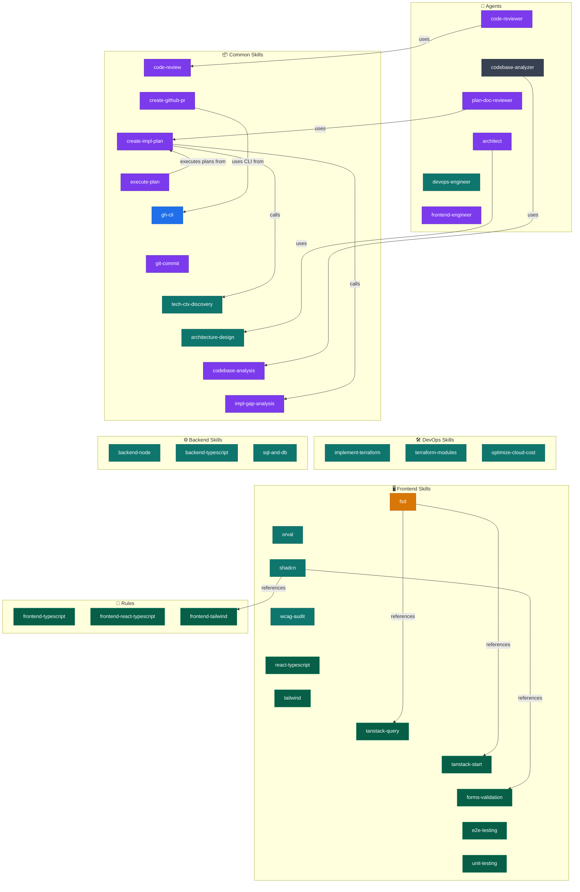

# PAIM AI SDLC — Cursor Skills & Agents

A curated collection of Cursor **Skills**, **Agents**, and **Rules** powering an AI-assisted software development lifecycle (SDLC) for frontend projects.

> Custom skills were created and redacted with the help of the `writing-skills` skill by obra, with TSH collection as one of the resources.

The rules have `alwaysApply` set to `true` only for presentational purposes, they are to be globbed.

---

## Structure

| Layer      | Count | Purpose                                                           |
| ---------- | ----- | ----------------------------------------------------------------- |
| **Agents** | 6     | Specialized sub-agents for review, analysis, planning, and DevOps |
| **Skills** | 27    | Reusable instruction sets invoked by the AI                       |
| **Rules**  | 3     | Always-applied coding standards (TypeScript, React, Tailwind)     |

---

## Agents

| Agent                           | Description                                                                                                                                     |
| ------------------------------- | ----------------------------------------------------------------------------------------------------------------------------------------------- |
| `common-architect`              | Solution architecture and technical specification specialist. Use when designing features, planning implementations, or analyzing trade-offs.   |
| `common-code-reviewer`          | Expert code review specialist. Use after completing a feature or fixing a bug. Triggers on review requests, PR reviews, or diff analysis.       |
| `common-codebase-analyzer`      | Analyzes codebase to classify existing code as reuse/modify/create for a set of requirements. Use during implementation planning.               |
| `common-plan-document-reviewer` | Plan document review specialist. Use after writing or updating implementation plan chunks to verify completeness and proper task decomposition. |
| `devops-engineer`               | Senior DevOps Engineer. Specialist in CI/CD pipelines, IaC (Terraform/K8s), cloud infrastructure, observability, and automation.                |
| `frontend-engineer`             | Senior Frontend Engineer specialist. Triggers on React, TypeScript, Tailwind, shadcn, TanStack, Orval, Vitest, Playwright, or FSD tasks.        |

---

## Skills

### Backend

| Skill                                    | Description                                                                                                                                              |
| ---------------------------------------- | -------------------------------------------------------------------------------------------------------------------------------------------------------- |
| `backend-node`                           | Node.js 22+ backends with TypeScript — type stripping, async patterns, streams, error handling, graceful shutdown, caching, logging, profiling, testing. |
| `backend-sql-and-database-understanding` | Database schemas, performant SQL queries, normalisation, indexing, joins, locking, transactions, EXPLAIN, and ORM integration (TypeORM, Prisma, etc.).   |
| `backend-typescript`                     | Type-safe backends — API contracts, domain models, branded IDs, generic repository/service patterns, Result types, narrowing unknown DB/API data.        |

### Common

| Skill                                                  | Description                                                                                                                                               |
| ------------------------------------------------------ | --------------------------------------------------------------------------------------------------------------------------------------------------------- |
| `common-architecture-design`                           | Designing solution architecture — analyzing codebase, resolving ambiguities, selecting patterns, producing structured implementation plan documents.      |
| `common-code-review`                                   | Reviewing code changes, PRs, or verifying implementations against project standards and acceptance criteria.                                              |
| `common-codebase-analysis`                             | Onboarding to unfamiliar codebases, auditing repository health, investigating architecture and dependencies, finding dead code and duplications.          |
| `common-create-github-pull-request-from-specification` | Create GitHub Pull Request for feature request from specification file using `pull_request_template.md`.                                                  |
| `common-create-implementation-plan`                    | Creating implementation plans for features, refactoring, upgrades, or architecture changes. Converts specs/requirements into actionable steps.            |
| `common-execute-plan`                                  | Executing an existing implementation plan file task-by-task from `docs/plans/`.                                                                           |
| `common-gh-cli`                                        | GitHub CLI (`gh`) comprehensive reference for repositories, issues, PRs, Actions, projects, releases, gists, codespaces, and organizations.               |
| `common-git-commit`                                    | Execute git commit with conventional commit message analysis, intelligent staging, and message generation. Triggers on `/commit`.                         |
| `common-implementation-gap-analysis`                   | Analyzing a codebase against requirements or a plan — what exists, what needs modification, and what needs to be built from scratch.                      |
| `common-technical-context-discovery`                   | Establishing technical context at the start of any implementation task — checking project rules, codebase patterns, then external docs in priority order. |

### DevOps

| Skill                                   | Description                                                                                                                                      |
| --------------------------------------- | ------------------------------------------------------------------------------------------------------------------------------------------------ |
| `devops-implement-terraform`            | Creating or modifying Terraform modules — context discovery, safety guardrails, architect escalation, cost estimation, and plan validation.      |
| `devops-implementing-terraform-modules` | Creating reusable Terraform modules, standardizing AWS cloud provisioning, and implementing IaC best practices.                                  |
| `devops-optimize-cloud-cost`            | Reducing cloud expenses, analyzing infrastructure costs, right-sizing resources, and optimizing reserved/spot pricing across AWS, Azure, or GCP. |

### Frontend

| Skill                          | Description                                                                                                                                       |
| ------------------------------ | ------------------------------------------------------------------------------------------------------------------------------------------------- |
| `frontend-e2e-testing`         | Playwright E2E tests — locators, assertions, Page Object Model, fixtures, network mocking, authentication state, flaky test diagnosis.            |
| `frontend-forms-validation`    | Forms with Zod v4 and React Hook Form — schema definition, validation, Controller, useFieldArray, multi-step forms, server error mapping.         |
| `frontend-fsd`                 | Feature-Sliced Design — file placement, feature/entity/widget structure, cross-import resolution, and FSD patterns for auth, Redux, React Query.  |
| `frontend-orval`               | Generate type-safe API clients, TanStack Query hooks, Zod schemas, MSW mocks, Hono handlers from OpenAPI specs using Orval.                       |
| `frontend-react-typescript`    | React 19 patterns — props typing, generic components, useTransition, useRef typing, context, custom hooks, compound components.                   |
| `frontend-shadcn`              | shadcn/ui — adding, searching, fixing, debugging, styling, and composing components. Works with component registries and presets.                 |
| `frontend-tailwind`            | Tailwind CSS v4 — themes, responsive design, container queries, dark mode, CVA variants, arbitrary values, and the `cn()` utility.                |
| `frontend-tanstack-query`      | TanStack Query (React Query) — queries, mutations, caching, optimistic updates, pagination, infinite queries, prefetching, debugging stale data.  |
| `frontend-tanstack-start`      | TanStack Start — routes, server functions, middleware, SSR/streaming, route protection, session management, and API routes.                       |
| `frontend-unit-testing`        | Vitest and React Testing Library — test naming, AAA pattern, query priority, userEvent, mocking, async testing, fake timers, test data factories. |
| `frontend-wcag-audit-patterns` | WCAG 2.2 accessibility audits — automated testing, manual verification, and remediation guidance.                                                 |

---

## Rules

| Rule                        | Description                                                                                                                                    |
| --------------------------- | ---------------------------------------------------------------------------------------------------------------------------------------------- |
| `frontend-typescript`       | TypeScript conventions — type aliases, inference, immutability, const assertions, discriminated unions, naming, functions, and error handling. |
| `frontend-react-typescript` | React 19 hard constraints — component declarations, ref as prop, no `useFormState`, event handler naming, context, props-to-state prefix.      |
| `frontend-tailwind`         | Tailwind CSS v4 hard constraints — no dynamic class names, no `var()` or hex colors in `className`, semantic classes only.                     |

---

## Entity Map & Dependencies

Colors indicate **origin/source** of each entity:

**Legend:**

| Color     | Source                                                                        |
| --------- | ----------------------------------------------------------------------------- |
| 🟣 Purple | Custom — written for this project                                             |
| 🔵 Blue   | GitHub                                                                        |
| 🟢 Teal   | Third-party (Orval, shadcn, wshobson, chekouts app, TSH collection, mcollina) |
| 🟠 Amber  | Personal + Anthropic `skill-creator`                                          |
| ⬛ Dark   | Cursor built-in (`create-rule`) — agents                                      |
| 🌲 Green  | Personal + Cursor `create-rule` — rules                                       |

---

> Solid arrows (`-->`) indicate **runtime usage** relationships.
